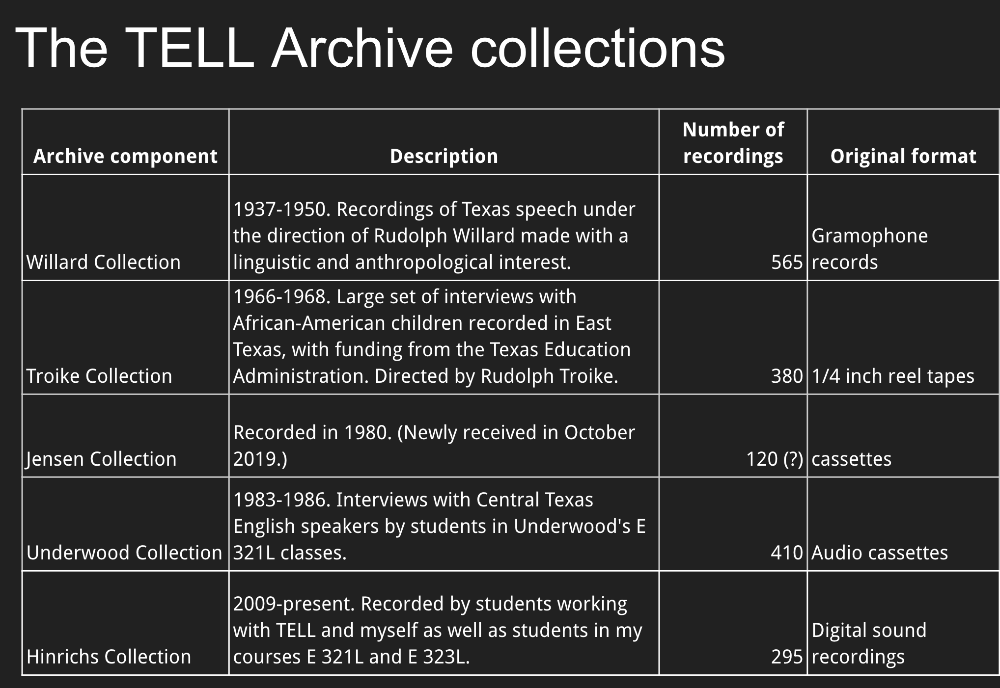
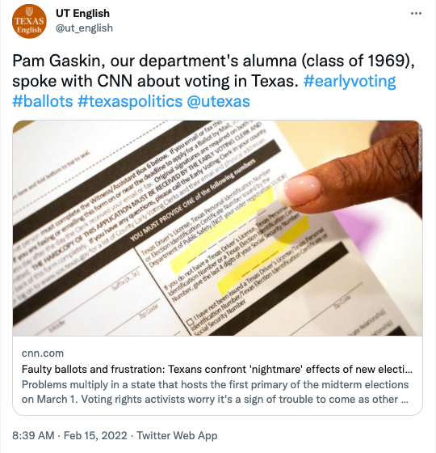
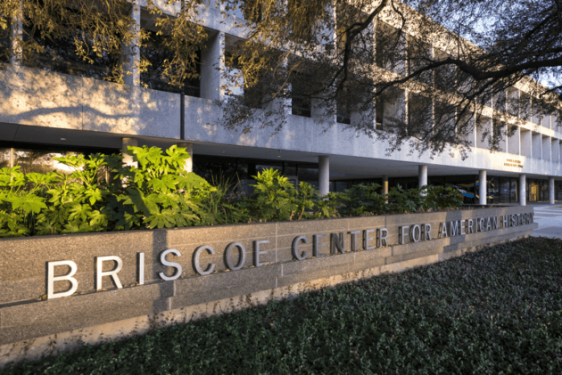
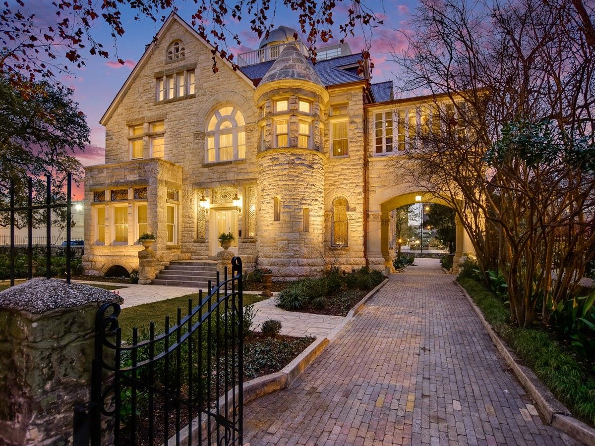
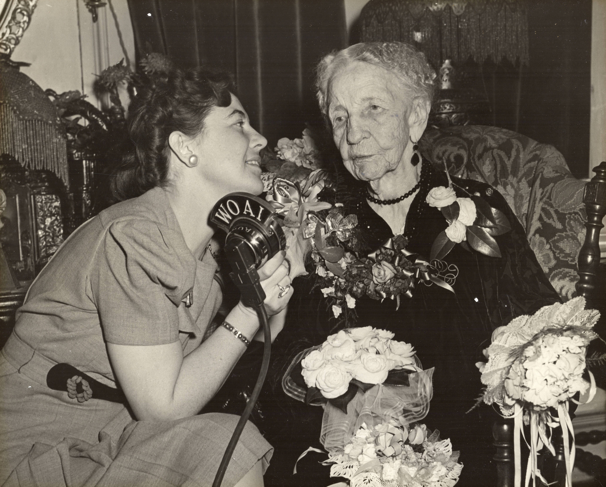
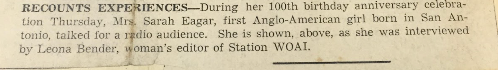
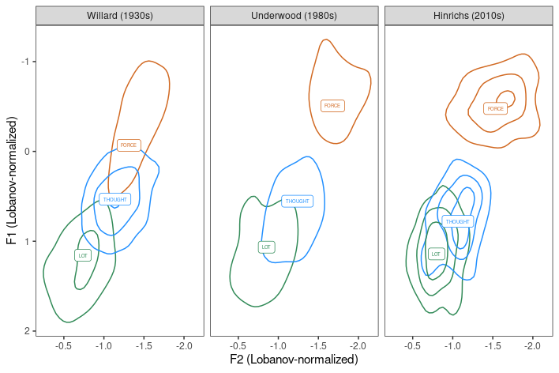

layout: true

<div class="my-footer"><span class="highlight-front">slides:&emsp;<a href="https://tell-dates.netlify.app">tell-dates.netlify.app</a>&emsp;|&emsp;web:&emsp;<a href="https://larshinrichs.site">larshinrichs.site</a></span></div> 

---
class: middle

```{r setup, include=FALSE}
options(htmltools.dir.version = FALSE)
knitr::opts_chunk$set(
  fig.width=9, fig.height=3.5, fig.retina=3,
  out.width = "100%",
  cache = FALSE,
  echo = TRUE,
  message = FALSE, 
  warning = FALSE,
  hiline = TRUE
)

require(pacman)
p_load(tidyverse, here)
```

```{r xaringan-themer, include=FALSE, warning=FALSE}
library(xaringanthemer)
style_mono_light(base_color = "#23395b",
  inverse_header_color = "#FFFFFF",
  title_slide_background_image = "title.png",
  header_font_google = google_font("Josefin Sans", "600"),
  text_font_google   = google_font("Josefin Sans", "300", "300i"),
  code_font_google   = google_font("Fira Mono"),
  text_font_size = '1.9em',
  code_font_size = '0.7em',
  colors = c(white = "#FFFFFF")
)
```

```{r xaringan-tile-view, echo=FALSE}
xaringanExtra::use_tile_view()
```

```{r xaringanExtra, echo=FALSE}
xaringanExtra::use_xaringan_extra(c("tile_view", "animate_css", "tachyons"))
```

```{r xaringan-scribble, echo=FALSE, eval=FALSE}

# currently turned off!

xaringanExtra::use_scribble()
```

```{r xaringan-logo, echo=FALSE}
xaringanExtra::use_logo(
  image_url = "img/tell.png",
)
```


<!-- ############## USE ABOVE AS TEMPLATE ############## -->

## The "Digital Archive of Texas English Speech"

1. What is DATES?
1. The topic: analog legacy data
1. DATES: Look and listen
1. What people do with DATES
   1. in linguistics
   1. in the fine arts
1. Funding

---
class: inverse, middle, center

# Analog legacy data

---
## Archival challenges

- digitization

--

- metadata availability

- metadata cataloguing

--

- transcription

--

- spectrographic analysis

--

- access

---
class: inverse, middle, center

# DATES: Look and listen

---
class: center, middle



---
class: center, middle

## [The Willard Collection](https://sites.google.com/view/tell-archive/about)

---

## Challenges in creating <br>a balanced sample of TxE speech

"Balanced" - in what sense?

--

- gender

--

- age

--

- ethnic identity

---
class: center


## How to redress demographic <br>imbalance in the archive (maybe)

.pull-left[
[](https://twitter.com/ut_english/status/1493595931668885506)
<br />
]

--

.pull-right[


[Pam's oral history at the Briscoe Center](https://digitalcollections.briscoecenter.org/item/419256)
]

---
class: middle

## The oldest speaker in the collection

.center[
.pull-left[<iframe width="300" height="168" src="https://www.youtube.com/embed/buQENTEV7-k" title="YouTube video player" frameborder="0" allow="accelerometer; autoplay; clipboard-write; encrypted-media; gyroscope; picture-in-picture" allowfullscreen></iframe>

<p>Mrs. Sarah Eagar, interviewed by WOAI San Antonio in Feb. 1942 on her 100th birthday
]

.pull-right[
Maverick Carter House<br>San Antonio, TX

  

]]

---

## Sarah Eagar (1842-1947)

.pull-left[

### The Riddle/Eagars: A well-known family

[A Guide to the Riddle and Eagar Families Papers,
1840-1945](https://txarchives.org/drtsa/finding_aids/00054.xml) <br>.small[UT Libraries/Texas Archival Resources Online]

]

.pull-right[
.center[
<br>
]

]

---

### From Carter Brown (Sep. 2021)


.pull-left[.small[

`r fontawesome::fa(name = "fas fa-quote-left")`
A couple years ago we digitized the 16" Transcription record and found it to feature our third great grandmother, Sarah Elizabeth Riddle Eagar.  Sarah was born in San Antonio in 1842 and died there at the age of 105 in 1947...

Sarah's mother, Elizabeth Menefee, was born in Virginia and lived in Tennessee for a time before moving to Texas in 1841. Sarah's father, Wilson Riddle, was born in Ballyblack,]] 

.pull-right[.small[

Northern Ireland and moved to Pennsylvania at around the age of 12. Later he moved to Tennessee and finally Texas in 1839. Sarah was the first girl born to (white) American settlers of early San Antonio (surviving adulthood). Her early childhood education came from the Ursuline Academy in San Antonio. Later education included Athens Female Institute in Alabama and the Bascom Female Seminary in Mississippi. `r fontawesome::fa(name = "fas fa-quote-right")`
]]

---
class: middle, center

## The 1980s speakers

[1980s: Underwood Collection](https://utexas.box.com/s/hh836rcm95smg17zgyuspt3q5ep2o6gs) .small[(protected folder)]

---
class: inverse, middle, center

# What do people do with DATES?

---
## Primary purpose: linguistic study

Studying language variation: real vs. apparent time

--


---
class: middle, center

.small[Recent conference paper: Bohmann & Hinrichs 2021]
<br>


---
class: middle

.center[

## *News of the World* with Tom Hanks (2021)

<iframe width="560" height="315" src="https://www.youtube.com/embed/zTZDb_iKooI" title="YouTube video player" frameborder="0" allow="accelerometer; autoplay; clipboard-write; encrypted-media; gyroscope; picture-in-picture" allowfullscreen></iframe>

]

---
class: inverse, middle, center

# Funding

---
## Funding

- HRA (2014)

--

- VW Foundation (Hannover, Germany)


---
class: middle, center

background-image: url("img/cowboy.jpeg")
background-size: cover

<br /><br />
.white.large.cowboy[Thank y'all!]


