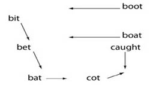

layout: true

<div class="my-footer"><span class="highlight-front">slides:&emsp;<a href="https://tell-dates.netlify.app">tell-dates.netlify.app</a>&emsp;|&emsp;web:&emsp;<a href="https://larshinrichs.site">larshinrichs.site</a></span></div> 

---
class: middle

```{r setup, include=FALSE}
options(htmltools.dir.version = FALSE)
knitr::opts_chunk$set(
  fig.width=9, fig.height=3.5, fig.retina=3,
  out.width = "100%",
  cache = FALSE,
  echo = TRUE,
  message = FALSE, 
  warning = FALSE,
  hiline = TRUE
)

require(pacman)
p_load(tidyverse, here)
```

```{r xaringan-themer, include=FALSE, warning=FALSE}
library(xaringanthemer)
style_mono_light(base_color = "#23395b",
  inverse_header_color = "#FFFFFF",
  title_slide_background_image = "title.png",
  header_font_google = google_font("Josefin Sans", "600"),
  text_font_google   = google_font("Josefin Sans", "300", "300i"),
  code_font_google   = google_font("Fira Mono"),
  text_font_size = '1.9em',
  code_font_size = '0.7em',
  colors = c(white = "#FFFFFF")
)
```

```{r xaringan-tile-view, echo=FALSE}
xaringanExtra::use_tile_view()
```

```{r xaringanExtra, echo=FALSE}
xaringanExtra::use_xaringan_extra(c("tile_view", "animate_css", "tachyons"))
```

```{r xaringan-scribble, echo=FALSE, eval=FALSE}

# currently turned off!

xaringanExtra::use_scribble()
```

```{r xaringan-logo, echo=FALSE}
xaringanExtra::use_logo(
  image_url = "img/tell.png",
)
```


<!-- ############## USE ABOVE AS TEMPLATE ############## -->

## The "Digital Archive of Texas English Speech"

1. What is DATES?
1. The topic: analog legacy data
1. DATES: Look and listen
1. What people do with DATES
   1. in linguistics
   1. in the fine arts
1. Funding

---
class: inverse, middle, center

# Analog legacy data

---
## Archival challenges

- digitization

--

- metadata availability

- metadata cataloguing

--

- transcription

--

- spectrographic analysis

--

- access

---
class: inverse, middle, center

# DATES: Look and listen

---
class: center, middle


---
class: center, middle

## [The Willard Collection](https://sites.google.com/view/tell-archive/about)

---

## Challenges in creating <br>a balanced sample of TxE speech

"Balanced" - in what sense?

--

- gender

--

- age

--

- ethnic identity

---

## How to redress demographic <br>imbalance, maybe


.pull-left[
[](https://twitter.com/ut_english/status/1493595931668885506)
<br />
]

--

.pull-right[


[Pam's oral history at the Briscoe Center](https://digitalcollections.briscoecenter.org/item/419256)
]
---
class: middle

## The oldest speaker in the collection

.pull-left[<iframe width="560" height="315" src="https://www.youtube.com/embed/buQENTEV7-k" title="YouTube video player" frameborder="0" allow="accelerometer; autoplay; clipboard-write; encrypted-media; gyroscope; picture-in-picture" allowfullscreen></iframe>

<p> .small[Mrs. Sarah Eager, interviewed by WOAI San Antonio<br>in February 1942 on her 100th birthday] 
]

.pull-right[
- Maverick Carter House (San Antonio, TX)

  

]
---
class: middle

## The 1980s speakers

[1980s: Underwood Collection](https://utexas.box.com/s/hh836rcm95smg17zgyuspt3q5ep2o6gs) .small[(protected folder)]

---
class: inverse, middle, center

# What do people do with DATES?

---
## Primary purpose: linguistic study

Studying language variation: real vs. apparent time

--



---
class: middle, center

.small[Recent conference paper: Bohmann & Hinrichs 2021]
<br>


---
class: middle

## *News of the World* with Tom Hanks (2021)

<iframe width="560" height="315" src="https://www.youtube.com/embed/zTZDb_iKooI" title="YouTube video player" frameborder="0" allow="accelerometer; autoplay; clipboard-write; encrypted-media; gyroscope; picture-in-picture" allowfullscreen></iframe>

---
class: inverse, middle, center

# Funding

---
## Funding

- HRA (2014)

--

- VW Foundation (Hannover, Germany)


---
class: middle, center

background-image: url("img/cowboy.jpeg")
background-size: cover

<br /><br />
.white.large.cowboy[Thank y'all!]


